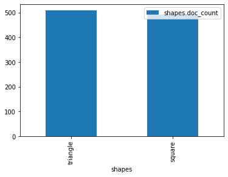
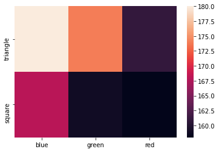

don't be plastic, elastipy!
===========================

Hi there, this tutorial is actually a `jupyter
notebook <https://jupyter.org/>`__ and can be found in
`examples <https://github.com/defgsus/elastipy/blob/development/examples/>`__/`tutorial.ipynb <https://github.com/defgsus/elastipy/blob/development/examples/tutorial.ipynb>`__

exporting some objects
----------------------

Without too much thinking we can just use the built-in export helper and
generate some data.

.. code:: ipython3

    from elastipy import Exporter
    
    class ShapeExporter(Exporter):
        INDEX_NAME = "elastipy-example-shapes"
        MAPPINGS = {
            "properties": {
                "shape": {"type": "keyword"},
                "color": {"type": "keyword"},
                "area": {"type": "float"},
            }
        }

The **INDEX\_NAME** is obviously the name of the elasticsearch index.
The **MAPPINGS** parameter describes the `elasticsearch
mapping <https://www.elastic.co/guide/en/elasticsearch/reference/current/mapping.html>`__.
Here we say that documents will at least have these common fields, one
of type **float** and two of type **keyword** which means they are
strings but not full-text searchable ones. Instead they are efficiently
indexed and aggregatable.

The data we create out of thin air..

.. code:: ipython3

    import random
    
    def shape_generator(count=1000):
        for i in range(count):
            yield {
                "shape": random.choice(("triangle", "square")),
                "color": random.choice(("red", "green", "blue")),
                "area": random.gauss(5, 1.3),
            }

Now create our exporter and export a couple of documents. It uses the
`bulk helper
tools <https://elasticsearch-py.readthedocs.io/en/7.10.0/helpers.html#bulk-helpers>`__
internally.

.. code:: ipython3

    exporter = ShapeExporter()
    
    count, errors = exporter.export_list(shape_generator(), refresh=True)
    
    print(count, "exported")

.. parsed-literal::

    1000 exported

The ``refresh=True`` parameter will refresh the index as soon as
everything is exported, so we do not have to wait for objects to appear
in the elasticsearch index.

query oh elastipyia
-------------------

In most cases this import is enough to access all the good stuff:

.. code:: ipython3

    from elastipy import Search, query

Now get some documents:

.. code:: ipython3

    s = Search(index="elastipy-example-shapes")

**s** is now a search request that can be configured. Setting any search
related options will always return a new instance. Here we set the
maximum number of documents to respond:

.. code:: ipython3

    s = s.size(3)

Next we add a
`query <https://www.elastic.co/guide/en/elasticsearch/reference/current/query-dsl.html>`__,
more specifically a `term
query <https://www.elastic.co/guide/en/elasticsearch/reference/current/query-dsl-term-query.html>`__.

.. code:: ipython3

    s = s.term(field="color", value="green")

Our request to elasticsearch would look like this right now:

.. code:: ipython3

    s.dump_body()

.. parsed-literal::

    {
      "query": {
        "term": {
          "color": {
            "value": "green"
          }
        }
      },
      "size": 3
    }

More queries can be added, which defaults to an **AND** combination:

.. code:: ipython3

    s = s.range(field="area", gt=5.)
    s.dump_body()

.. parsed-literal::

    {
      "query": {
        "bool": {
          "must": [
            {
              "term": {
                "color": {
                  "value": "green"
                }
              }
            },
            {
              "range": {
                "area": {
                  "gt": 5.0
                }
              }
            }
          ]
        }
      },
      "size": 3
    }

**OR** combinations can be archived with the
`bool <https://www.elastic.co/guide/en/elasticsearch/reference/current/query-dsl-bool-query.html>`__
query itself or by applying the ``|`` operator to the query classes in
``elastipy.query``:

.. code:: ipython3

    s = s | (query.Term(field="color", value="red") & query.Range(field="area", gt=8.))
    s.dump_body()

.. parsed-literal::

    {
      "query": {
        "bool": {
          "should": [
            {
              "bool": {
                "must": [
                  {
                    "term": {
                      "color": {
                        "value": "green"
                      }
                    }
                  },
                  {
                    "range": {
                      "area": {
                        "gt": 5.0
                      }
                    }
                  }
                ]
              }
            },
            {
              "bool": {
                "must": [
                  {
                    "term": {
                      "color": {
                        "value": "red"
                      }
                    }
                  },
                  {
                    "range": {
                      "area": {
                        "gt": 8.0
                      }
                    }
                  }
                ]
              }
            }
          ]
        }
      },
      "size": 3
    }

Better execute the search now before the body get's too complicated:

.. code:: ipython3

    response = s.execute()
    response.dump()

.. parsed-literal::

    {
      "took": 0,
      "timed_out": false,
      "_shards": {
        "total": 1,
        "successful": 1,
        "skipped": 0,
        "failed": 0
      },
      "hits": {
        "total": 177,
        "max_score": 2.1233923,
        "hits": [
          {
            "_index": "elastipy-example-shapes",
            "_type": "_doc",
            "_id": "d37_EHcBeebHNMb6j4ln",
            "_score": 2.1233923,
            "_source": {
              "shape": "triangle",
              "color": "red",
              "area": 8.161720398415362
            }
          },
          {
            "_index": "elastipy-example-shapes",
            "_type": "_doc",
            "_id": "H37_EHcBeebHNMb6j4yL",
            "_score": 2.1233923,
            "_source": {
              "shape": "square",
              "color": "red",
              "area": 8.751862677144198
            }
          },
          {
            "_index": "elastipy-example-shapes",
            "_type": "_doc",
            "_id": "PH7_EHcBeebHNMb6j4yL",
            "_score": 2.1233923,
            "_source": {
              "shape": "triangle",
              "color": "red",
              "area": 8.263903219083177
            }
          }
        ]
      }
    }

The response object is a small wrapper around ``dict`` that has some
convenience properties.

.. code:: ipython3

    response.documents

.. parsed-literal::

    [{'shape': 'triangle', 'color': 'red', 'area': 8.161720398415362},
     {'shape': 'square', 'color': 'red', 'area': 8.751862677144198},
     {'shape': 'triangle', 'color': 'red', 'area': 8.263903219083177}]

How many documents are there at all?

.. code:: ipython3

    Search(index="elastipy-example-shapes").execute().total_hits

.. parsed-literal::

    1000

--------------

The functions and properties are tried to make chainable in a way that
allows for short and powerful oneliners:

.. code:: ipython3

    Search(index="elastipy-example-shapes") \
        .size(20).sort("-area").execute().documents

.. parsed-literal::

    [{'shape': 'square', 'color': 'green', 'area': 10.757878730657522},
     {'shape': 'square', 'color': 'red', 'area': 8.751862677144198},
     {'shape': 'triangle', 'color': 'blue', 'area': 8.541624200945225},
     {'shape': 'square', 'color': 'green', 'area': 8.26443611605174},
     {'shape': 'triangle', 'color': 'red', 'area': 8.263903219083177},
     {'shape': 'square', 'color': 'green', 'area': 8.20544696686534},
     {'shape': 'square', 'color': 'blue', 'area': 8.173174690689201},
     {'shape': 'triangle', 'color': 'red', 'area': 8.161720398415362},
     {'shape': 'square', 'color': 'blue', 'area': 8.129373665518143},
     {'shape': 'triangle', 'color': 'blue', 'area': 8.054759575559462},
     {'shape': 'square', 'color': 'green', 'area': 8.0165474606851},
     {'shape': 'triangle', 'color': 'green', 'area': 8.004952048190786},
     {'shape': 'square', 'color': 'red', 'area': 7.992181662989541},
     {'shape': 'triangle', 'color': 'blue', 'area': 7.931510848279542},
     {'shape': 'triangle', 'color': 'blue', 'area': 7.9261724535798805},
     {'shape': 'triangle', 'color': 'red', 'area': 7.916567681480393},
     {'shape': 'square', 'color': 'green', 'area': 7.888963108234958},
     {'shape': 'square', 'color': 'green', 'area': 7.813700513935615},
     {'shape': 'triangle', 'color': 'blue', 'area': 7.797382164673575},
     {'shape': 'square', 'color': 'green', 'area': 7.74108943694938}]

So this was the document response. Let's dive inside and start
aggregating on fields.

agitated aggregation
--------------------

Aggregations can be created using the ``agg_``, ``metric_`` and
``pipeline_`` prefixes. An aggregation is **attached** to the ``Search``
instance, so there is no copying like with the queries above.

.. code:: ipython3

    s = Search(index="elastipy-example-shapes").size(0)
    
    agg = s.agg_terms(field="shape")
    
    s.dump_body()

.. parsed-literal::

    {
      "aggregations": {
        "a0": {
          "terms": {
            "field": "shape"
          }
        }
      },
      "query": {
        "match_all": {}
      },
      "size": 0
    }

As we can see, a `terms
aggregation <https://www.elastic.co/guide/en/elasticsearch/reference/current/search-aggregations-bucket-terms-aggregation.html>`__
has been added to the search body. The names of aggregations are
auto-generated, but can be explicitly stated:

.. code:: ipython3

    s = Search(index="elastipy-example-shapes").size(0)
    
    agg = s.agg_terms("shapes", field="shape")
    
    s.dump_body()

.. parsed-literal::

    {
      "aggregations": {
        "shapes": {
          "terms": {
            "field": "shape"
          }
        }
      },
      "query": {
        "match_all": {}
      },
      "size": 0
    }

Let's look at the result from elasticsearch:

.. code:: ipython3

    s.execute()
    s.dump_response()

.. parsed-literal::

    {
      "took": 0,
      "timed_out": false,
      "_shards": {
        "total": 1,
        "successful": 1,
        "skipped": 0,
        "failed": 0
      },
      "hits": {
        "total": 1000,
        "max_score": null,
        "hits": []
      },
      "aggregations": {
        "shapes": {
          "doc_count_error_upper_bound": 0,
          "sum_other_doc_count": 0,
          "buckets": [
            {
              "key": "triangle",
              "doc_count": 509
            },
            {
              "key": "square",
              "doc_count": 491
            }
          ]
        }
      }
    }

valuable access
~~~~~~~~~~~~~~~

Because we kept the ``agg`` variable, we can use it's interface to
access the values more conveniently:

.. code:: ipython3

    agg.to_dict()

.. parsed-literal::

    {'triangle': 509, 'square': 491}

It supports the ``items()``, ``keys()`` and ``values()`` generators as
known from the ``dict`` type:

.. code:: ipython3

    for key, value in agg.items():
        print(f"{key:12} {value}")

.. parsed-literal::

    triangle     509
    square       491

It also has a ``dict_rows()`` generator which preseves the **names** and
**keys** of the aggregation:

.. code:: ipython3

    for row in agg.dict_rows():
        print(row)

.. parsed-literal::

    {'shapes': 'triangle', 'shapes.doc_count': 509}
    {'shapes': 'square', 'shapes.doc_count': 491}

The ``rows()`` generator flattens the ``dict_rows()`` into a CSV-style
list:

.. code:: ipython3

    for row in agg.rows():
        print(row)

.. parsed-literal::

    ['shapes', 'shapes.doc_count']
    ['triangle', 509]
    ['square', 491]

And we can print a nice table to the command-line:

.. code:: ipython3

    agg.print.table(colors=False)

.. parsed-literal::

    shapes   │ shapes.doc_count                           
    ─────────┼────────────────────────────────────────────
    triangle │ 509 ███████████████████████████████████████
    square   │ 491 █████████████████████████████████████▋ 

(The ``colors=False`` parameter disables console colors because they do
not work in this documentation)

--------------

Obviously, at this point a couple of users would not understand why
there is no conversion to a `pandas
DataFrame <https://pandas.pydata.org/pandas-docs/stable/reference/api/pandas.DataFrame.html>`__
built in:

.. code:: ipython3

    agg.to_pandas()  # or simply agg.df()

.. raw:: html

    

    
    <table border="1" class="dataframe">
      <thead>
        <tr style="text-align: right;">
          <th></th>
          <th>shapes.doc_count</th>
        </tr>
        <tr>
          <th>shapes</th>
          <th></th>
        </tr>
      </thead>
      <tbody>
        <tr>
          <th>triangle</th>
          <td>509</td>
        </tr>
        <tr>
          <th>square</th>
          <td>491</td>
        </tr>
      </tbody>
    </table>
    

The **index** and **columns** are assigned automatically. Also columns
containing ISO-formatted date strings will be converted to
``pandas.Timestamp``.

With ``matplotlib`` installed we can access the `pandas plotting
interface <https://pandas.pydata.org/pandas-docs/stable/reference/api/pandas.DataFrame.plot.html>`__:

.. code:: ipython3

    agg.df().plot.bar()

.. parsed-literal::

    <AxesSubplot:xlabel='shapes'>

Now let's look into the details when **metrics** or nested **bucket**
aggregations are involved.

deeper aggregation agitation
~~~~~~~~~~~~~~~~~~~~~~~~~~~~

.. code:: ipython3

    agg = Search(index="elastipy-example-shapes") \
        .agg_terms("shapes", field="shape") \
        .agg_terms("colors", field="color") \
        .metric_sum("area", field="area") \
        .metric_avg("avg-area", field="area") \
        .execute()

A few notes: - ``agg_`` methods always return the newly created
aggregation, so the ``colors`` aggregation is nested inside the
``shapes`` aggregation. - ``metric_`` methods return their parent
aggregation (because metrics do not allow a nested aggregation), so we
can just continue to call ``metric_*`` and each time we add a metric to
the ``colors`` aggregation. If you need to get access to the metric
object itself add the ``return_self=True`` parameter. - The ``execute``
method on an aggregation does not return the response but the
aggregation itself.

Now, what does the ``to_dict`` output look like?

.. code:: ipython3

    agg.to_dict()

.. parsed-literal::

    {('triangle', 'green'): 172,
     ('triangle', 'red'): 169,
     ('triangle', 'blue'): 168,
     ('square', 'green'): 170,
     ('square', 'blue'): 165,
     ('square', 'red'): 156}

It has put the **keys** that lead to each value into tuples. Without a
lot of thinking we can say:

.. code:: ipython3

    data = agg.to_dict()
    print(f"There are {data[('triangle', 'red')]} red triangles in the database!")

.. parsed-literal::

    There are 169 red triangles in the database!

But where are the metrics gone?

Generally, ``keys()``, ``values()``, ``items()``, ``to_dict()`` and
``to_matrix()`` only access the values of the **current aggregation**
(which is ``colors`` in the example). Although all the keys of the
parent **bucket** aggregations that lead to the values are included.

The methods ``dict_rows()``, ``rows()``, ``to_pandas()`` and
``print.table()`` will access **all values** from the whole aggregation
branch. In this example the branch looks like this:

-  shapes
-  colors

   -  area
   -  avg-area

.. code:: ipython3

    agg.print.table(digits=3, colors=False)

.. parsed-literal::

    shapes   │ shapes.doc_count    │ colors │ colors.doc_count    │ area                    │ avg-area            
    ─────────┼─────────────────────┼────────┼─────────────────────┼─────────────────────────┼─────────────────────
    triangle │ 509 ███████████████ │ green  │ 172 ███████████████ │ 867.763 ███████████████ │ 5.045 █████████████▉
    triangle │ 509 ███████████████ │ red    │ 169 ██████████████▊ │ 819.149 ██████████████▎ │ 4.847 █████████████▍
    triangle │ 509 ███████████████ │ blue   │ 168 ██████████████▋ │ 841.755 ██████████████▋ │  5.01 █████████████▊
    square   │ 491 ██████████████▌ │ green  │ 170 ██████████████▊ │ 865.368 ██████████████▉ │  5.09 ██████████████
    square   │ 491 ██████████████▌ │ blue   │ 165 ██████████████▍ │ 831.532 ██████████████▍ │  5.04 █████████████▉
    square   │ 491 ██████████████▌ │ red    │ 156 █████████████▋  │ 780.264 █████████████▋  │ 5.002 █████████████▊

Now all information is in the table. Note that the ``shapes.doc_count``
column contains the same value multiple times. This is because each
``colors`` aggregation bucket splits the ``shapes`` bucket into multiple
results, without changing the overall count of the shapes, of course.

Now what is this method with the awesome name ``to_matrix``?

.. code:: ipython3

    names, keys, matrix = agg.to_matrix()
    print("names ", names)
    print("keys  ", keys)
    print("matrix", matrix)

.. parsed-literal::

    names  ['shapes', 'colors']
    keys   [['triangle', 'square'], ['green', 'red', 'blue']]
    matrix [[172, 169, 168], [170, 156, 165]]

It produces a heatmap! At least in two dimensions. In this example we
have two dimensions from the **bucket** aggregations ``shapes`` and
``colors``. ``to_matrix()`` will produce a matrix with any number of
dimensions, but if it's one or two, we can also convert it to a
``DataFrame``:

.. code:: ipython3

    agg.df_matrix()

.. raw:: html

    

    
    <table border="1" class="dataframe">
      <thead>
        <tr style="text-align: right;">
          <th></th>
          <th>green</th>
          <th>red</th>
          <th>blue</th>
        </tr>
      </thead>
      <tbody>
        <tr>
          <th>triangle</th>
          <td>172</td>
          <td>169</td>
          <td>168</td>
        </tr>
        <tr>
          <th>square</th>
          <td>170</td>
          <td>156</td>
          <td>165</td>
        </tr>
      </tbody>
    </table>
    

And having something like `seaborn <https://seaborn.pydata.org/>`__
installed we can easily plot it:

.. code:: ipython3

    import seaborn as sns
    
    sns.heatmap(agg.df_matrix())

.. parsed-literal::

    <AxesSubplot:>

