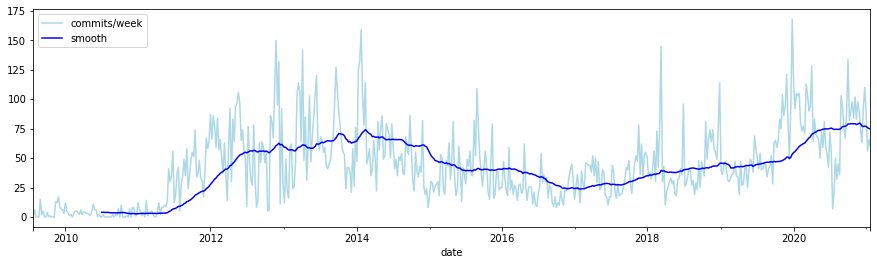
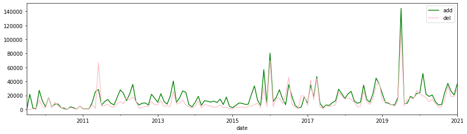
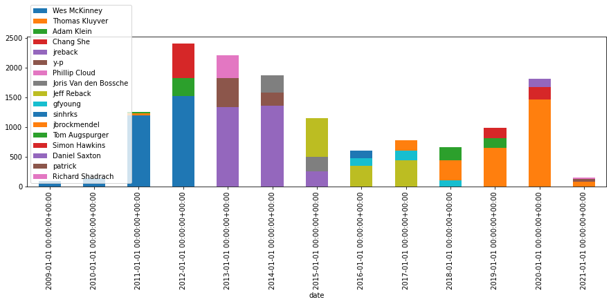
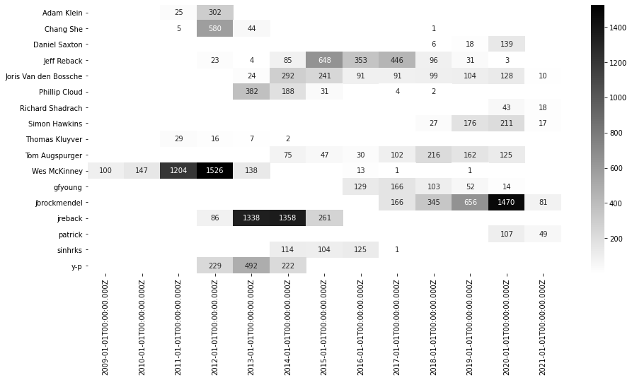
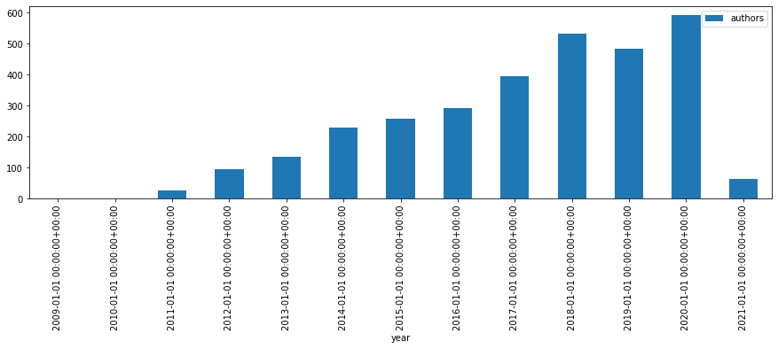
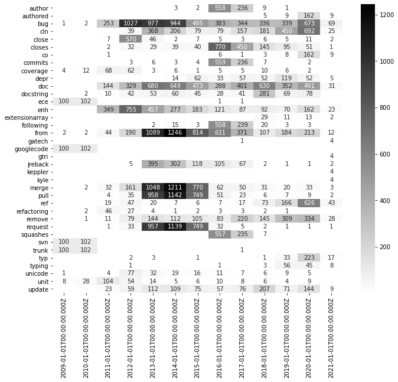
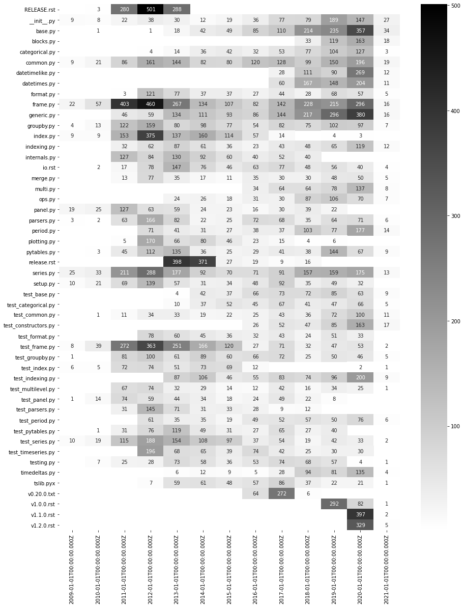
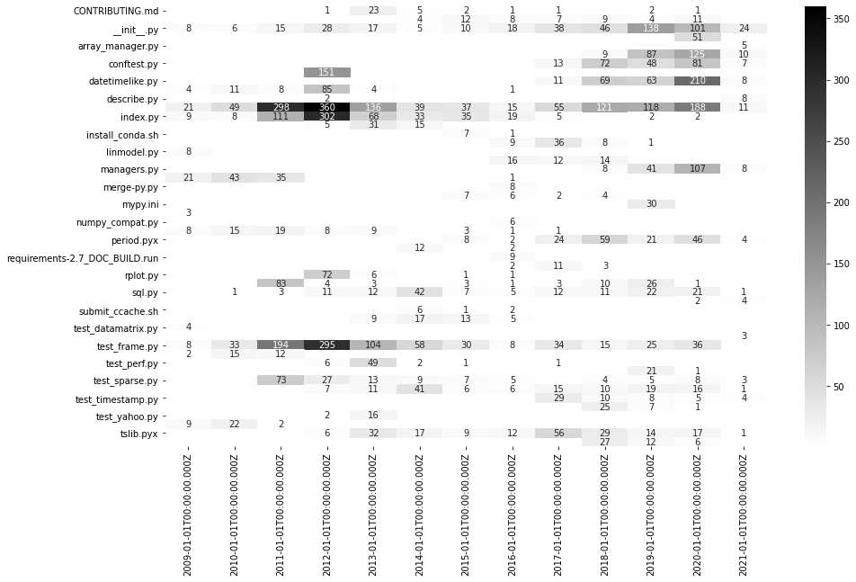
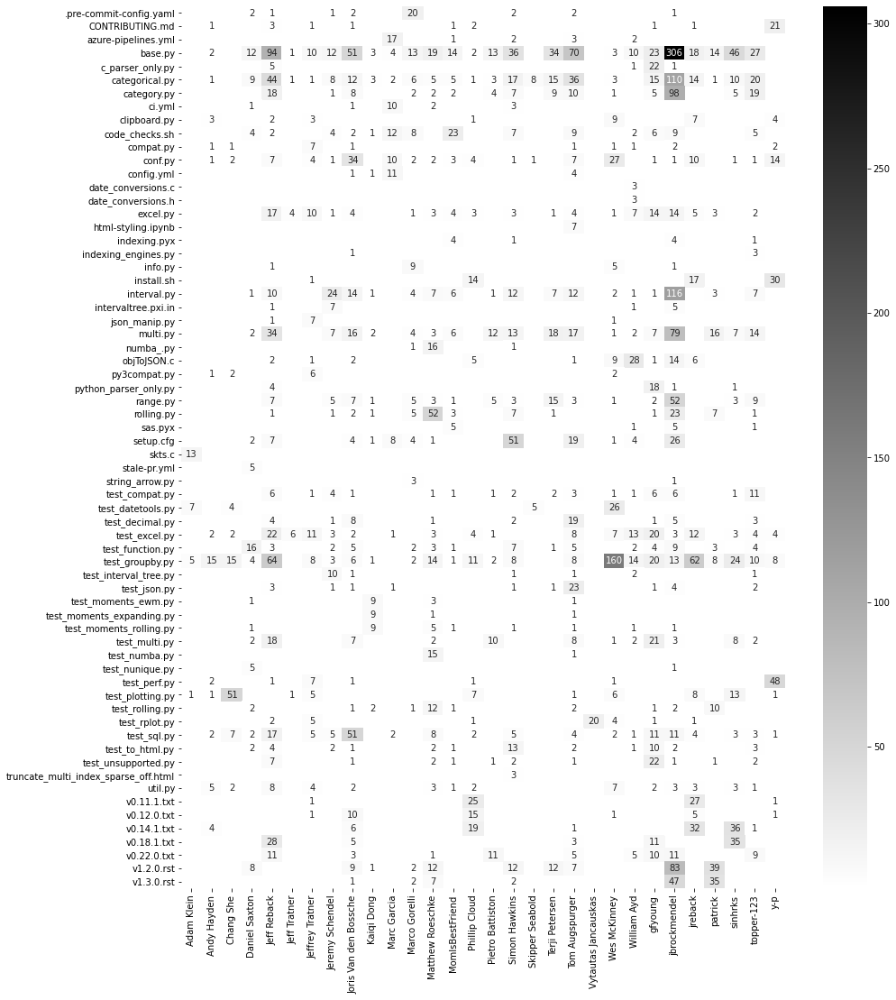

.. code:: python3

    import numpy as np
    from elastipy import Search, query

They always say: *put the imports at the top!*

git commit analytics
====================

Below we use a lot of :link:`pandas` and plotting to get insight into
the community of an open source project.

To explore a repository of your choice move to ``elastipy/examples/``
and call:

.. code:: bash

    python gitlogs.py <project-name> path/to/git-repo

If you are ``cloning`` a repository and are just interested in commits
you can somewhat limit the size on disk with:

.. code:: bash

    git clone <repo-url> --no-checkout

Replace the ``<project-name>`` with the name of the project and change
the value below in the ``notebook``:

.. code:: python3

    PROJECT = "pandas"
    
    def search():
        return Search(f"elastipy-example-commits-{PROJECT}")

activity
--------

commits per week
~~~~~~~~~~~~~~~~

.. code:: python3

    s = search()
    agg = s.agg_date_histogram("date", calendar_interval="week")
    df = agg.execute().df(to_index=True)
    df["commits/week"] = df.pop("date.doc_count")
    df["smooth"] = df.rolling(window=50).mean()
    df.plot(figsize=(15,4), color=["lightblue", "blue"])

additions/deletions per week
~~~~~~~~~~~~~~~~~~~~~~~~~~~~

.. code:: python3

    s = search()
    agg = s.agg_date_histogram("date", calendar_interval="month")
    agg.metric_sum("add", field="changes.additions")
    agg.metric_sum("del", field="changes.deletions")
    df = agg.execute().df(to_index=True, exclude="*doc_count")
    #df = df.rolling(window=10).mean()[["add", "del"]]
    df.plot.line(color=["green", "pink"], figsize=(15,4))

authors
-------

top 3 authors per year
~~~~~~~~~~~~~~~~~~~~~~

.. code:: python3

    s = search()
    agg = s.agg_date_histogram("date", calendar_interval="year")
    agg = agg.agg_terms("author", field="author", size=3)
    agg_top3_authors = agg
    agg.execute().df(to_index=True, flat="author", exclude="*doc_count").plot.bar(figsize=(15,4), stacked=True)

commits of all top 3 authors
^^^^^^^^^^^^^^^^^^^^^^^^^^^^

.. code:: python3

    top_authors = set(k[1] for k in agg_top3_authors.keys())
    
    s = search()
    agg = s.agg_filters("author", filters={key: query.Term("author", key) for key in top_authors})
    agg = agg.agg_date_histogram("date", calendar_interval="year")
    agg.execute().plot.heatmap(
        sort=True, replace={0: np.nan},
        annot=True, fmt=".0f", figsize=(15, .6), cmap="gray_r"
    )

top 3 average-additions per author per year
~~~~~~~~~~~~~~~~~~~~~~~~~~~~~~~~~~~~~~~~~~~

.. code:: python3

    s = search()
    agg = s.agg_filters("author", filters={key: query.Term("author", key) for key in top_authors})
    agg = agg.agg_date_histogram("date", calendar_interval="year")
    agg = agg.metric_avg("avg-add", field="changes.additions", return_self=True)
    agg.execute().plot.heatmap(
        sort=True, replace={0: np.nan},
        annot=True, fmt=".0f", figsize=(15, .6), cmap="gray_r"
    )

.. image:: gitlogs_files/gitlogs_16_1.png

number of authors per year
~~~~~~~~~~~~~~~~~~~~~~~~~~

.. code:: python3

    s = search()
    global_authors = s.metric_cardinality(field="author", return_self=True)
    agg = s.agg_date_histogram("year", calendar_interval="year")
    agg = agg.metric_cardinality("authors", field="author")
    agg.execute().plot.bar("year", "authors", figsize=(15, 4))
    print(next(global_authors.values()), "authors at all")

.. parsed-literal::

    2504 authors at all

--------------

commit messages
---------------

the first ten commit messages
~~~~~~~~~~~~~~~~~~~~~~~~~~~~~

.. code:: python3

    s = search().sort("timestamp")
    # s = s.range("timestamp", gte="2020")
    for d in s.execute().documents:
        print(("-- %(timestamp)s %(hash)s\n%(message)s" % d).strip() + "\n")

.. parsed-literal::

    -- 2009-07-31T15:07:16+00:00 9d0080576446de475d34b0dbb58389b15cd4f529
    Initial directory structure.
    
    git-svn-id: http://pandas.googlecode.com/svn/trunk@1 d5231056-7de3-11de-ac95-d976489f1ece
    
    -- 2009-08-05T02:32:49+00:00 ec1a0a2a2571dc2c1c26612b374d4a66b22f0938
    adding trunk
    
    git-svn-id: http://pandas.googlecode.com/svn/trunk@2 d5231056-7de3-11de-ac95-d976489f1ece
    
    -- 2009-08-05T02:33:13+00:00 1eeadf4e401647faa20911f531bc05c1872262ea
    oops
    
    git-svn-id: http://pandas.googlecode.com/svn/trunk@3 d5231056-7de3-11de-ac95-d976489f1ece
    
    -- 2009-08-05T03:17:29+00:00 445114e1b20da8d4976c8d9050aa90c5bd508c54
    added svn:ignore
    
    git-svn-id: http://pandas.googlecode.com/svn/trunk@4 d5231056-7de3-11de-ac95-d976489f1ece
    
    -- 2009-08-05T03:30:16+00:00 c6b236db73ff81007909be6406f0e484edc4a9eb
    first commit with cleaned up code
    
    git-svn-id: http://pandas.googlecode.com/svn/trunk@5 d5231056-7de3-11de-ac95-d976489f1ece
    
    -- 2009-08-05T03:40:05+00:00 c8efebf2bfbe6a1efc732679ad3cf2d06d795c3f
    minor edit
    
    git-svn-id: http://pandas.googlecode.com/svn/trunk@6 d5231056-7de3-11de-ac95-d976489f1ece
    
    -- 2009-08-05T03:54:33+00:00 21e01d94a0632539f76eb702408540b0d9adcb59
    fixed isinf reference
    
    git-svn-id: http://pandas.googlecode.com/svn/trunk@7 d5231056-7de3-11de-ac95-d976489f1ece
    
    -- 2009-09-01T15:10:47+00:00 0f6d8b435670053a393b65c621d6eab090a36633
    latest edits, miscellaneous cleanup and bug fixes from development
    
    git-svn-id: http://pandas.googlecode.com/svn/trunk@8 d5231056-7de3-11de-ac95-d976489f1ece
    
    -- 2009-09-01T15:13:32+00:00 171487fd4ea85aa38b224ee3cd5c41356063e197
    added stats empty directory
    
    git-svn-id: http://pandas.googlecode.com/svn/trunk@9 d5231056-7de3-11de-ac95-d976489f1ece
    
    -- 2009-09-01T15:50:21+00:00 39c033cbe697b488f6f612c9d154a467aaca76a1
    fixed inconsistency with dateCol parameter
    
    git-svn-id: http://pandas.googlecode.com/svn/trunk@10 d5231056-7de3-11de-ac95-d976489f1ece
    

significant terms by year
~~~~~~~~~~~~~~~~~~~~~~~~~

.. code:: python3

    def significant_terms_by_year(s, field, size=4, shard_size=100):
        agg = s.copy().agg_date_histogram("year", calendar_interval="year")
        agg = agg.agg_significant_terms(field=field, size=size, shard_size=shard_size)
        keywords = set(k[-1] for k in agg.execute().keys())
    
        agg = s.agg_date_histogram("date", calendar_interval="year")
        agg = agg.agg_filters("word", filters={key: query.Term(field, key) for key in keywords})
        agg.execute().plot.heatmap(
            sort=True, replace={0: np.nan},
            transpose=True, annot=True, fmt=".0f", figsize=(.3, .7), cmap="gray_r"
        )
        
    significant_terms_by_year(search(), "message")

.. image:: gitlogs_files/gitlogs_24_0.png

significant terms by author
~~~~~~~~~~~~~~~~~~~~~~~~~~~

.. code:: python3

    def significant_terms_by_terms(s, split_field, terms_field, split_size=30, size=3, shard_size=100):
        agg = s.copy().agg_terms(split_field, field=split_field, size=split_size)
        agg = agg.agg_significant_terms("term", field=terms_field, size=size, shard_size=shard_size)
        df = agg.execute().df(include=["term", "term.doc_count"])
        
        # find max count of all significant terms
        df = df.groupby("term").max()
        # print(df.describe())
        
        # and drop everything above a high percentile 
        df = df[df < df.quantile(.8)].dropna()
        keywords = list(df.index)
    
        agg = s.agg_terms(split_field, field=split_field, size=split_size)
        agg = agg.agg_filters("term", filters={key: query.Term(terms_field, key) for key in keywords})
        agg.execute().plot.heatmap(
            sort=True, transpose=True, replace={0: np.nan}, 
            annot=True, fmt=".0f", figsize=(.23, .6), cmap="gray_r"
        )
        
    significant_terms_by_terms(search(), "author", "message")

files
-----

overall top 50 edited files per year
~~~~~~~~~~~~~~~~~~~~~~~~~~~~~~~~~~~~

.. code:: python3

    s = search()
    agg = s.agg_terms(field="changes.file", size=50)
    agg = agg.agg_date_histogram("date", calendar_interval="year")
    df = agg.execute().plot.heatmap(
        sort=True, replace={0: np.nan},
        annot=True, fmt=".0f", figsize=(.3, 1.5), cmap="gray_r"
    )

significant changed files by year
~~~~~~~~~~~~~~~~~~~~~~~~~~~~~~~~~

.. code:: python3

    s = search().param(rest_total_hits_as_int=True)
    # remove version specific files
    s = ~s.query_string("changes.file: *.txt *.rst")
    significant_terms_by_year(s, "changes.file")

.. image:: gitlogs_files/gitlogs_31_0.png

significant changed files by author
~~~~~~~~~~~~~~~~~~~~~~~~~~~~~~~~~~~

.. code:: python3

    significant_terms_by_terms(search(), "author", "changes.file")

which files get edited together
~~~~~~~~~~~~~~~~~~~~~~~~~~~~~~~

.. code:: python3

    s = search()
    s = s.query_string("changes.file: __init__.py")
    
    agg = s.agg_terms(field="changes.file", size=50)
    agg = agg.agg_date_histogram("date", calendar_interval="year")
    try:
        agg.execute().plot.heatmap(figsize=(.3, 1.5), cmap="gray_r")
    except ValueError:
        pass

