.. code:: python3

    import numpy as np
    import matplotlib
    import seaborn
    
    from elastipy import Search, query

They always say: *put the imports at the top!*

Git commit analytics
====================

Below we use a lot of :link:`pandas` and plotting to get insight into
the community and development of an open source project.

To explore a repository of your choice, clone it to your disk, move to
``elastipy/examples/`` and call:

.. code:: bash

   python gitlogs.py <project-name> /path/to/git-repo

When ``cloning`` a repository only to inspect commits you can somewhat
limit the size on disk with:

.. code:: bash

   git clone <repo-url> --no-checkout

Replace the ``<project-name>`` with the name of the project and change
the value below in the ``notebook``:

.. code:: python3

    # by default, we look at the fantastic pandas library
    PROJECT = "pandas"
    
    def search() -> Search:
        return Search(f"elastipy-example-commits-{PROJECT}")

Looking at the first commit:

.. code:: python3

    search().size(1).sort("timestamp").execute().dump()

.. parsed-literal::

    {
      "took": 2,
      "timed_out": false,
      "_shards": {
        "total": 1,
        "successful": 1,
        "skipped": 0,
        "failed": 0
      },
      "hits": {
        "total": {
          "value": 10000,
          "relation": "gte"
        },
        "max_score": null,
        "hits": [
          {
            "_index": "elastipy-example-commits-pandas",
            "_id": "9d0080576446de475d34b0dbb58389b15cd4f529",
            "_score": null,
            "_source": {
              "hash": "9d0080576446de475d34b0dbb58389b15cd4f529",
              "author": "Wes McKinney",
              "author_email": "wesmckinn@gmail.com",
              "timestamp": "2009-07-31T15:07:16+00:00",
              "message": "Initial directory structure.\n\ngit-svn-id: http://pandas.googlecode.com/svn/trunk@1 d5231056-7de3-11de-ac95-d976489f1ece\n",
              "timestamp_hour": 15,
              "timestamp_weekday": "5 Friday",
              "project": "pandas"
            },
            "sort": [
              1249052836000
            ]
          }
        ]
      }
    }

Activity
--------

Commits per week
~~~~~~~~~~~~~~~~

.. code:: python3

    df = (
        search()
        .agg_date_histogram("date", calendar_interval="week")
        .execute().df().set_index("date")
        .rename({"date.doc_count": "commits/week"}, axis=1)
    )
    df["smooth"] = df.rolling(window=50).mean()
    df.plot(figsize=(15,4), color=["lightblue", "blue"])

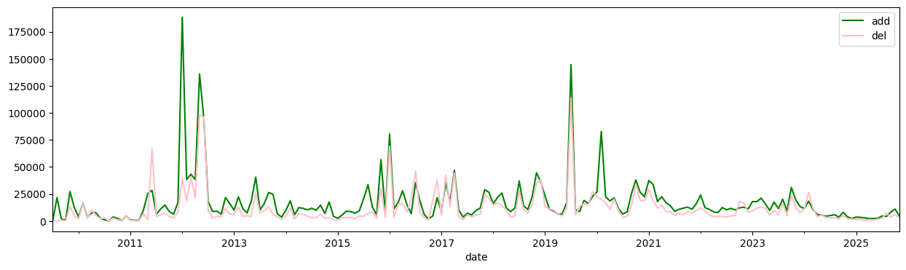

Additions/deletions per week
~~~~~~~~~~~~~~~~~~~~~~~~~~~~

.. code:: python3

    df = (
        search()
        .agg_date_histogram("date", calendar_interval="month")
        .metric_sum("add", field="changes.additions")
        .metric_sum("del", field="changes.deletions")
        .execute().df(exclude="*doc_count").set_index("date")
    )
    df.plot.line(color=["green", "pink"], figsize=(15,4))

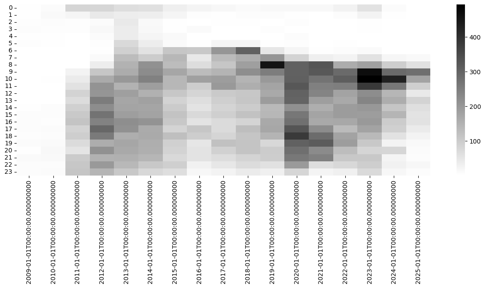

Commits per weekday/hour for each year
~~~~~~~~~~~~~~~~~~~~~~~~~~~~~~~~~~~~~~

.. code:: python3

    def commits_per(field, interval="year"):
        df = (
            search()
            .agg_date_histogram(interval, calendar_interval=interval)
            .agg_terms("weekday", field=field, size=100)
            .execute()
            .df_matrix()
            .sort_index().sort_index(axis=1)
        )
        df.index = df.index.year
        seaborn.heatmap(df.T, cmap="gray_r")
    
    commits_per("timestamp_weekday")

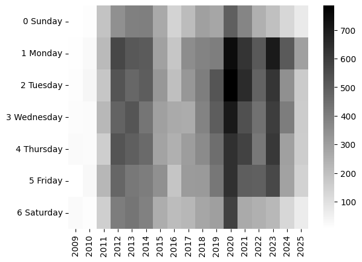

.. code:: python3

    commits_per("timestamp_hour")

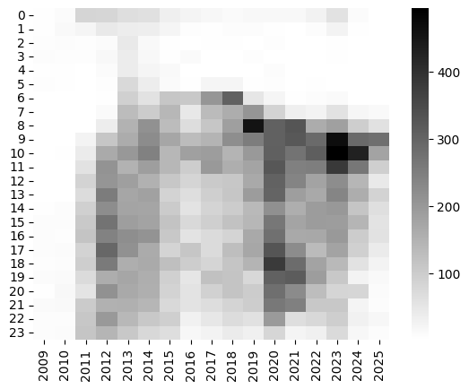

Authors
-------

Number of authors per year
~~~~~~~~~~~~~~~~~~~~~~~~~~

.. code:: python3

    s = search()
    # store access to global metric (without aggregation)
    global_authors = s.metric_cardinality(field="author", return_self=True)
    df = (
        s.agg_date_histogram("year", calendar_interval="year")
        .metric_cardinality("authors", field="author")
        .execute().df(exclude="*.doc_count")
    )
    print()
    df["year"] = df["year"].dt.year
    df.plot.bar(
        "year", "authors", figsize=(15, 4), 
        title=f"{PROJECT} authors per year ({next(global_authors.values()):,} authors at all)"
    )

.. parsed-literal::

    

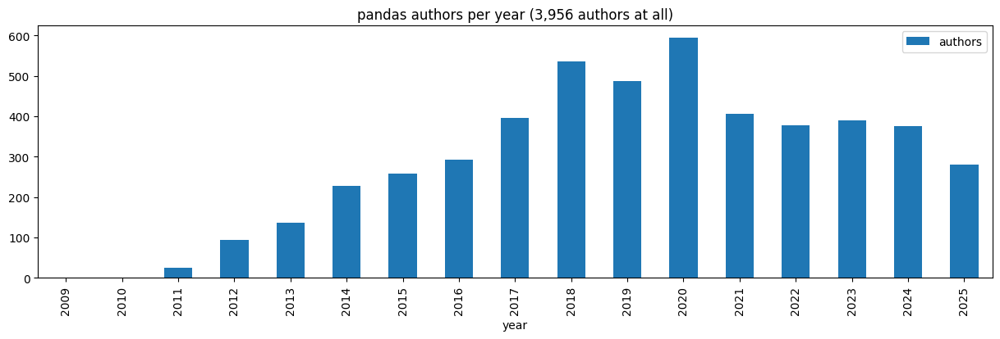

Top 3 authors per year
~~~~~~~~~~~~~~~~~~~~~~

.. code:: python3

    agg_top3_authors = (
        search()
        .agg_date_histogram("date", calendar_interval="year")
        .agg_terms("author", field="author", size=3)
        .execute()
    )
    (
        agg_top3_authors
        .df(flat="author", exclude="*doc_count")
        .set_index("date")
        .plot.bar(figsize=(15,6), stacked=True, cmap="tab20")
    )

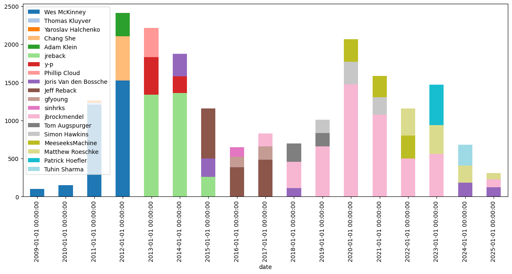

Commits of top 3 authors
^^^^^^^^^^^^^^^^^^^^^^^^

.. code:: python3

    # get set of all of the above top-3-per-year authors
    top_authors = set(k[1] for k in agg_top3_authors.keys())
    
    df = (
        search()
        .agg_filters("author", filters={
            key: query.Term("author", key) 
            for key in top_authors
        })
        .agg_date_histogram("date", calendar_interval="year")
        .execute()
        # two nested aggregations above produce a 2d matrix
        .df_matrix(sort=True)
        .replace({0: np.nan})
    )
    df.columns = df.columns.year
    seaborn.heatmap(df, cmap="bone_r")

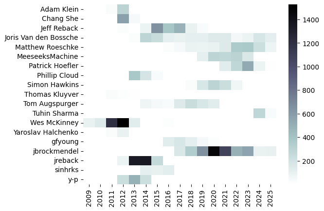

Commit messages
---------------

The first ten commit messages
~~~~~~~~~~~~~~~~~~~~~~~~~~~~~

.. code:: python3

    s = search().sort("timestamp")
    # s = s.range("timestamp", gte="2020")
    for d in s.execute().documents:
        print(("-- %(timestamp)s %(hash)s\n%(message)s" % d).strip() + "\n")

.. parsed-literal::

    -- 2009-07-31T15:07:16+00:00 9d0080576446de475d34b0dbb58389b15cd4f529
    Initial directory structure.
    
    git-svn-id: http://pandas.googlecode.com/svn/trunk@1 d5231056-7de3-11de-ac95-d976489f1ece
    
    -- 2009-08-05T02:32:49+00:00 ec1a0a2a2571dc2c1c26612b374d4a66b22f0938
    adding trunk
    
    git-svn-id: http://pandas.googlecode.com/svn/trunk@2 d5231056-7de3-11de-ac95-d976489f1ece
    
    -- 2009-08-05T02:33:13+00:00 1eeadf4e401647faa20911f531bc05c1872262ea
    oops
    
    git-svn-id: http://pandas.googlecode.com/svn/trunk@3 d5231056-7de3-11de-ac95-d976489f1ece
    
    -- 2009-08-05T03:17:29+00:00 445114e1b20da8d4976c8d9050aa90c5bd508c54
    added svn:ignore
    
    git-svn-id: http://pandas.googlecode.com/svn/trunk@4 d5231056-7de3-11de-ac95-d976489f1ece
    
    -- 2009-08-05T03:30:16+00:00 c6b236db73ff81007909be6406f0e484edc4a9eb
    first commit with cleaned up code
    
    git-svn-id: http://pandas.googlecode.com/svn/trunk@5 d5231056-7de3-11de-ac95-d976489f1ece
    
    -- 2009-08-05T03:40:05+00:00 c8efebf2bfbe6a1efc732679ad3cf2d06d795c3f
    minor edit
    
    git-svn-id: http://pandas.googlecode.com/svn/trunk@6 d5231056-7de3-11de-ac95-d976489f1ece
    
    -- 2009-08-05T03:54:33+00:00 21e01d94a0632539f76eb702408540b0d9adcb59
    fixed isinf reference
    
    git-svn-id: http://pandas.googlecode.com/svn/trunk@7 d5231056-7de3-11de-ac95-d976489f1ece
    
    -- 2009-09-01T15:10:47+00:00 0f6d8b435670053a393b65c621d6eab090a36633
    latest edits, miscellaneous cleanup and bug fixes from development
    
    git-svn-id: http://pandas.googlecode.com/svn/trunk@8 d5231056-7de3-11de-ac95-d976489f1ece
    
    -- 2009-09-01T15:13:32+00:00 171487fd4ea85aa38b224ee3cd5c41356063e197
    added stats empty directory
    
    git-svn-id: http://pandas.googlecode.com/svn/trunk@9 d5231056-7de3-11de-ac95-d976489f1ece
    
    -- 2009-09-01T15:50:21+00:00 39c033cbe697b488f6f612c9d154a467aaca76a1
    fixed inconsistency with dateCol parameter
    
    git-svn-id: http://pandas.googlecode.com/svn/trunk@10 d5231056-7de3-11de-ac95-d976489f1ece
    

Significant terms per year
~~~~~~~~~~~~~~~~~~~~~~~~~~

The
`significant_terms <https://www.elastic.co/guide/en/elasticsearch/reference/master/search-aggregations-bucket-significantterms-aggregation.html>`__
aggregation finds terms that are significantly more frequent within an
aggregation bucket compared to all the rest, using the `term frequency &
inverse document
frequency <https://en.wikipedia.org/wiki/Tf%E2%80%93idf>`__ method.

.. code:: python3

    def significant_terms_by_year(s: Search, field: str, size=3, shard_size=100):
        # get the set of most significant terms per year
        keywords = (
            s.copy()
            .agg_date_histogram("year", calendar_interval="year")
            .agg_significant_terms(field=field, size=size, shard_size=shard_size)
            .execute().keys()
        )
        keywords = set(k[-1] for k in keywords)
    
        # and then plot frequency for each of the terms over every year
        df = (
            s.agg_date_histogram("date", calendar_interval="year")
            .agg_filters("word", filters={key: query.Term(field, key) for key in keywords})
            .execute()
            .df_matrix(sort=True).replace({0: np.nan})
        )
        df.index = df.index.year
        matplotlib.pyplot.subplots(figsize=(7, df.shape[1] / 4))
        seaborn.heatmap(df.T, fmt=".0f", cmap="bone_r")
        
    significant_terms_by_year(search(), "message")

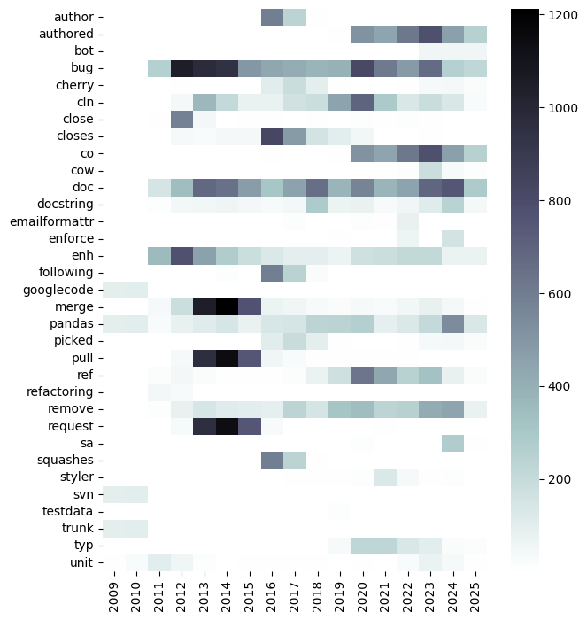

Significant terms by author
~~~~~~~~~~~~~~~~~~~~~~~~~~~

.. code:: python3

    def significant_terms_by_terms(s, split_field, terms_field, split_size=30, size=3, shard_size=100):
        # get set of significant terms by author
        df = (
            s.copy()
            .agg_terms(split_field, field=split_field, size=split_size)
            .agg_significant_terms("term", field=terms_field, size=size, shard_size=shard_size)
            .execute().df(include="term*")
        )
        # find max count of all significant terms
        df = df.groupby("term").max()
        
        # and drop everything above a high percentile 
        df = df[df < df.quantile(.7)].dropna()
        keywords = list(df.index)
    
        df = (
            s.agg_terms(split_field, field=split_field, size=split_size)
            .agg_filters("term", filters={key: query.Term(terms_field, key) for key in keywords})
            .execute()
            .df_matrix(sort=True).replace({0: np.nan})
        )
        matplotlib.pyplot.subplots(figsize=(df.shape[0] / 4, df.shape[1] / 4))
        seaborn.heatmap(df.T, fmt=".0f", cmap="summer_r")
        
    significant_terms_by_terms(search(), "author", "message")

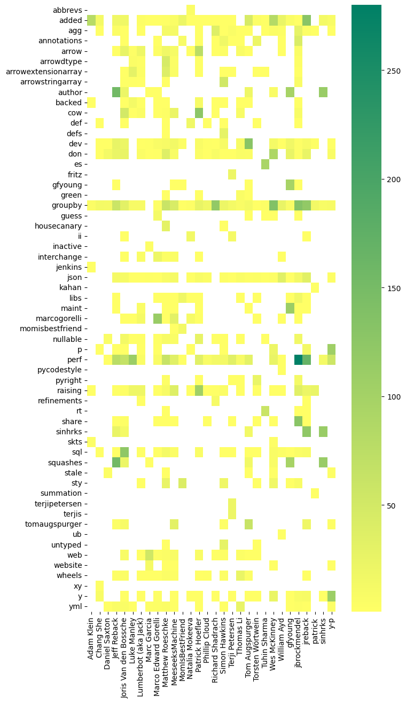

Files
-----

Overall top 50 edited files per year
~~~~~~~~~~~~~~~~~~~~~~~~~~~~~~~~~~~~

.. code:: python3

    df = (
        search()
        .agg_terms(field="changes.file", size=50)
        .agg_date_histogram("date", calendar_interval="year")
        .execute()
        .df_matrix(sort=True)
    )
    df.columns = df.columns.year
    matplotlib.pyplot.subplots(figsize=(7, 10))
    seaborn.heatmap(df, fmt=".0f", cmap="gray_r")

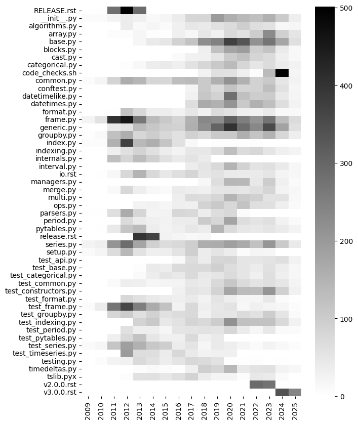

Significant changed files by year
~~~~~~~~~~~~~~~~~~~~~~~~~~~~~~~~~

.. code:: python3

    # remove version specific files
    s = ~search().query_string("changes.file: *.txt *.rst")
    significant_terms_by_year(s, "changes.file")

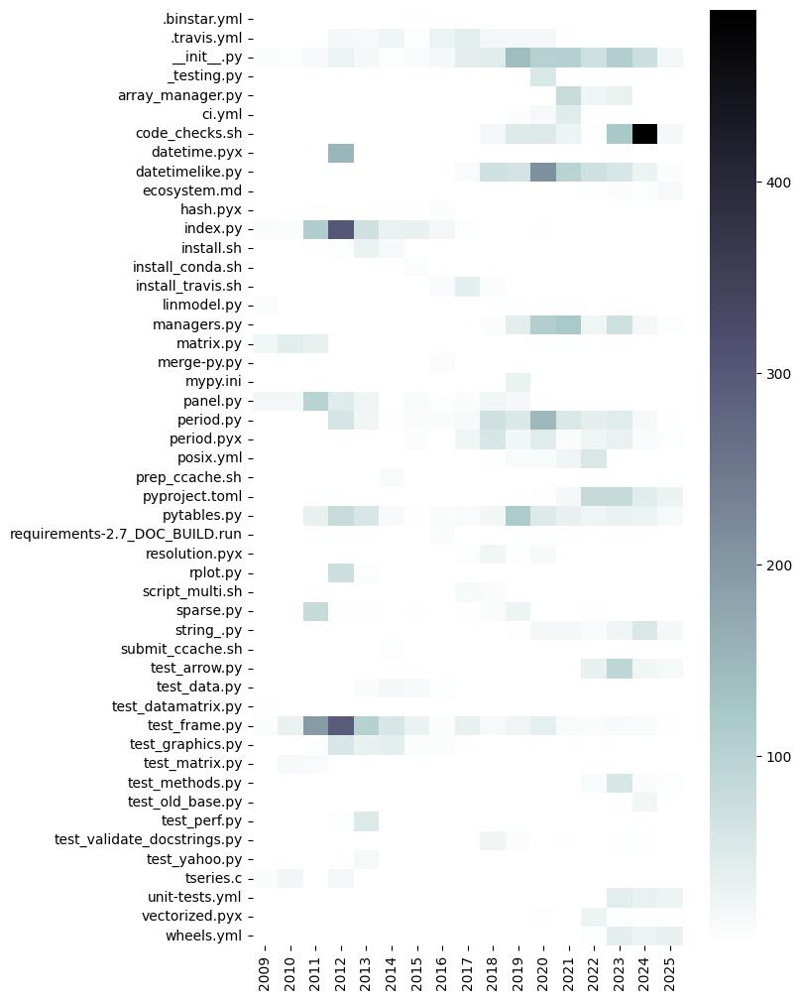

Significant changed files by author
~~~~~~~~~~~~~~~~~~~~~~~~~~~~~~~~~~~

.. code:: python3

    significant_terms_by_terms(search(), "author", "changes.file")

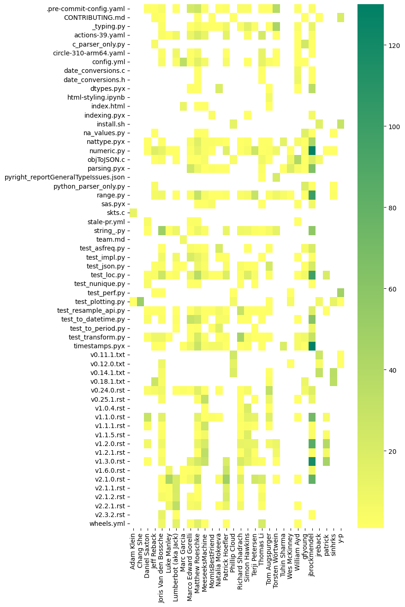

Which files get edited together
~~~~~~~~~~~~~~~~~~~~~~~~~~~~~~~

The commit documents exported to elasticsearch contain the changed files
per commit as list of objects, e.g:

.. code:: python3

    search().term("hash", "0f6d8b435670053a393b65c621d6eab090a36633").execute().dump.documents()

.. parsed-literal::

    [
      {
        "hash": "0f6d8b435670053a393b65c621d6eab090a36633",
        "author": "Wes McKinney",
        "author_email": "wesmckinn@gmail.com",
        "timestamp": "2009-09-01T15:10:47+00:00",
        "message": "latest edits, miscellaneous cleanup and bug fixes from development\n\ngit-svn-id: http://pandas.googlecode.com/svn/trunk@8 d5231056-7de3-11de-ac95-d976489f1ece\n",
        "changes": [
          {
            "filepath": "pandas/core/frame.py",
            "file": "frame.py",
            "additions": 7,
            "deletions": 14
          },
          {
            "filepath": "pandas/core/matrix.py",
            "file": "matrix.py",
            "additions": 317,
            "deletions": 276
          },
          {
            "filepath": "pandas/core/series.py",
            "file": "series.py",
            "additions": 231,
            "deletions": 186
          }
        ],
        "timestamp_hour": 15,
        "timestamp_weekday": "2 Tuesday",
        "project": "pandas"
      }
    ]

So it’s possible to check which files got changed in the same commit:

.. code:: python3

    # get some filenames to look at
    top_files = sorted(search().agg_terms(field="changes.file", size=30).execute().keys())
    
    filters = {
        f: query.Term("changes.file", f)
        for f in top_files
    }
    df = (
        search()
        .terms("changes.file", top_files)
        .agg_filters("file1", filters=filters)
        .agg_filters("file2", filters=filters)
        .execute().df_matrix().replace({0: np.nan})
    )
    df = df.loc[:, top_files]
    matplotlib.pyplot.subplots(figsize=(df.shape[1]/3.3, df.shape[0]/4))
    seaborn.heatmap(df, cmap="managua")

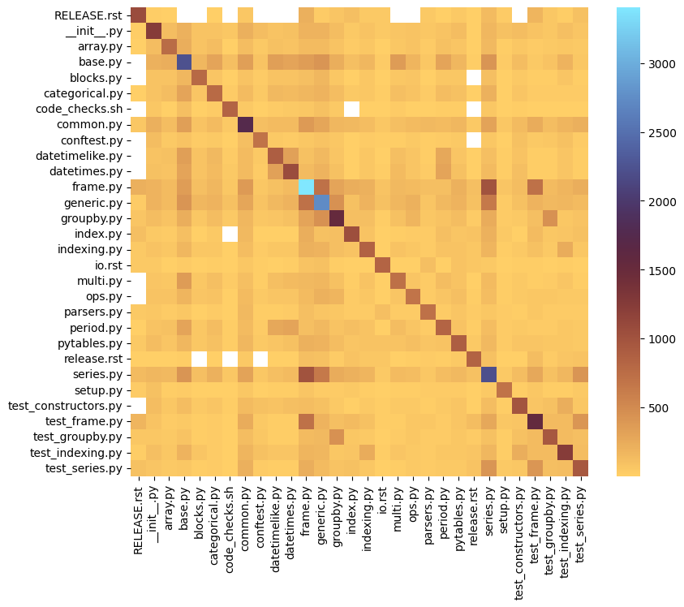

