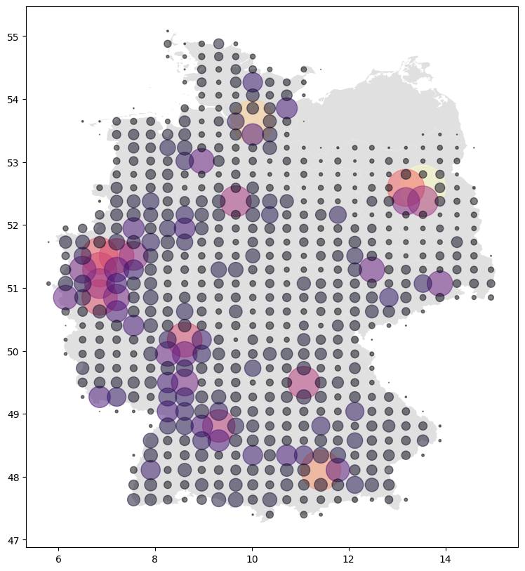

Plotting maps
=============

Here are examples to plot geographic data using
`plotly <https://plotly.com>`__ and
`matplotlib <https://matplotlib.org/>`__. Matplotlib is probably the
choice if you need a rendered image. Plotly creates interactive plots
and has a *more modern* interface.

To handle the different geo-types returned by elasticsearch we first
look at conversion utilities. `Skip it <#geo-centroid>`__ if you just
want to see pretty images.

Coordinate conversion
---------------------

A metric aggregation like
:link:`geo_centroid <Aggregation.metric_geo_centroid>` already returns
`latitude and
longitude <https://en.wikipedia.org/wiki/Geographic_coordinate_system#Latitude_and_longitude>`__
values.

Bucket-aggregations like
:link:`geotile_grid <Aggregation.agg_geotile_grid>` and
:link:`geohash_grid <Aggregation.agg_geohash_grid>` return keys that
can be **mapped** to geo-coordinates.

map-tiles
~~~~~~~~~

The :link:`geotile_grid <Aggregation.agg_geotile_grid>` aggregation
uses *map-tiles*
(`wikipedia <https://en.wikipedia.org/wiki/Tiled_web_map>`__) as bucket
keys. They represent ``zoom``/``x``/``y`` as seen below:

.. code:: python3

    from elastipy import Search
    
    s = Search(index="elastipy-example-car-accidents")
    
    agg = s.agg_geotile_grid("tiles", field="location", precision=6)
    
    agg.execute().to_dict()

.. parsed-literal::

    {'6/33/21': 131436,
     '6/34/21': 36158,
     '6/33/20': 35218,
     '6/33/22': 32519,
     '6/34/22': 19237,
     '6/34/20': 13802}

To convert the keys to
`geo-coordinates <https://en.wikipedia.org/wiki/Geographic_coordinate_system#Latitude_and_longitude>`__
we can use a helper function in elastipy:

.. code:: python3

    from elastipy import geotile_to_lat_lon
    
    {
        geotile_to_lat_lon(key): value
        for key, value in agg.items()
    }

.. parsed-literal::

    {(50.736455137010644, 8.4375): 131436,
     (50.736455137010644, 14.0625): 36158,
     (54.162433968067795, 8.4375): 35218,
     (47.04018214480665, 8.4375): 32519,
     (47.04018214480665, 14.0625): 19237,
     (54.162433968067795, 14.0625): 13802}

Becaue the tiles are actually **areas** the latitude and longitude just
represent a single point within the area. The point can be defined as
the ``offset`` parameter and defaults to ``(.5, .5)`` which is the
center of the tile.

Here we print the *top-left* and *bottom-right* coordinates for each
map-tile:

.. code:: python3

    for key, value in agg.items():
        tl = geotile_to_lat_lon(key, offset=(0, 1))
        bl = geotile_to_lat_lon(key, offset=(1, 0))
        print(f"{tl} - {bl}: {value}")

.. parsed-literal::

    (48.92249926375824, 5.625) - (52.48278022207821, 11.25): 131436
    (48.92249926375824, 11.25) - (52.48278022207821, 16.875): 36158
    (52.48278022207821, 5.625) - (55.77657301866769, 11.25): 35218
    (45.08903556483103, 5.625) - (48.92249926375824, 11.25): 32519
    (45.08903556483103, 11.25) - (48.92249926375824, 16.875): 19237
    (52.48278022207821, 11.25) - (55.77657301866769, 16.875): 13802

geohash
~~~~~~~

The :link:`geohash_grid <Aggregation.agg_geohash_grid>` aggregation
returns *geohash*
(`wikipedia <https://en.wikipedia.org/wiki/Geohash>`__) bucket keys.

.. code:: python3

    from elastipy import Search
    
    s = Search(index="elastipy-example-car-accidents")
    
    agg = s.agg_geohash_grid("tiles", field="location", precision=2)
    
    agg.execute().to_dict()

.. parsed-literal::

    {'u1': 113676, 'u0': 85497, 'u3': 41653, 'u2': 27544}

The `pygeohash <https://github.com/wdm0006/pygeohash>`__ package can be
used to translate them:

.. code:: python3

    import pygeohash
    
    {
        pygeohash.decode(key): value
        for key, value in agg.items()
    }

.. parsed-literal::

    {LatLong(latitude=53.4375, longitude=5.625): 113676,
     LatLong(latitude=47.8125, longitude=5.625): 85497,
     LatLong(latitude=53.4375, longitude=16.875): 41653,
     LatLong(latitude=47.8125, longitude=16.875): 27544}

For convenience the pygeohash function is wrapped by
``elastipy.geohash_to_lat_lon``.

plotly backend
--------------

The `plotly python library <https://plotly.com/python/>`__ enables
creating browser-based plots in python. It supports a range of `map
plots <https://plotly.com/python/maps/>`__. In particular the
`mapbox <https://www.mapbox.com/>`__ based plots are interesting because
they use WebGL and render quite fast even for a large number of items.

geo-centroid
~~~~~~~~~~~~

Let’s plot an overview of the german car accidents (included in elastipy
`examples <https://github.com/netzkolchose/elastipy/blob/development/examples/accidents_export.py>`__).

.. code:: python3

    s = Search(index="elastipy-example-car-accidents")
    agg = s.agg_terms("city", field="city", size=10000)
    agg = agg.metric_geo_centroid("location", field="location")
    
    df = agg.execute().df()
    print(f"{df.shape[0]} cities")
    df.head()

.. parsed-literal::

    8451 cities

.. raw:: html

    

    
    <table border="1" class="dataframe">
      <thead>
        <tr style="text-align: right;">
          <th></th>
          <th>city</th>
          <th>city.doc_count</th>
          <th>location.lat</th>
          <th>location.lon</th>
        </tr>
      </thead>
      <tbody>
        <tr>
          <th>0</th>
          <td>München</td>
          <td>4979</td>
          <td>48.145224</td>
          <td>11.558930</td>
        </tr>
        <tr>
          <th>1</th>
          <td>Köln</td>
          <td>4562</td>
          <td>50.940086</td>
          <td>6.961585</td>
        </tr>
        <tr>
          <th>2</th>
          <td>Frankfurt am Main</td>
          <td>2639</td>
          <td>50.117909</td>
          <td>8.653241</td>
        </tr>
        <tr>
          <th>3</th>
          <td>Bremen</td>
          <td>2459</td>
          <td>53.091255</td>
          <td>8.800806</td>
        </tr>
        <tr>
          <th>4</th>
          <td>Düsseldorf</td>
          <td>2390</td>
          <td>51.224550</td>
          <td>6.799716</td>
        </tr>
      </tbody>
    </table>
    

The :link:`geo_centroid <Aggregation.metric_geo_centroid>` aggregation
above returns the center coordinate of all accidents within a city.
(It’s not necessarily the center of the city but the
`centroid <https://en.wikipedia.org/wiki/Centroid>`__ of all accidents
that are assigned to the city.)

Below we pass the pandas DataFrame to the plotly express function and
tell it the names of the latitude and longitude columns. The number of
accidents per city is also used for the color and size of the points.

.. code:: python3

    import plotly.express as px
    
    fig = px.scatter_mapbox(
        df, 
        lat="location.lat", lon="location.lon", 
        color="city.doc_count", opacity=.5, size="city.doc_count",
        zoom=4.8,
        mapbox_style="carto-positron",
        hover_data=["city"],
        labels={"city.doc_count": "number of accidents"},
        
    )
    fig.update_layout(margin={"r": 0, "t": 0, "l": 0, "b": 0})

.. parsed-literal::

    /tmp/ipykernel_34638/3257653371.py:3: DeprecationWarning: *scatter_mapbox* is deprecated! Use *scatter_map* instead. Learn more at: https://plotly.com/python/mapbox-to-maplibre/
      fig = px.scatter_mapbox(

The most amazing thing we should notice is that the federal state
Mecklenburg-Vorpommern does not have any accidents! 🍀

density heatmap
~~~~~~~~~~~~~~~

The plotly express tools are just lovely ♥ ❤️ ♥ ❤️

.. code:: python3

    fig = px.density_mapbox(
        df, 
        lat="location.lat", lon="location.lon", 
        z="city.doc_count", 
        zoom=4.8,
        mapbox_style="carto-positron",
        hover_data=["city"],
        labels={"city.doc_count": "number of accidents"},
    )
    fig.update_layout(margin={"r": 0, "t": 0, "l": 0, "b": 0})

.. parsed-literal::

    /tmp/ipykernel_34638/1269988560.py:1: DeprecationWarning:
    
    *density_mapbox* is deprecated! Use *density_map* instead. Learn more at: https://plotly.com/python/mapbox-to-maplibre/
    

geohash_grid aggregation
~~~~~~~~~~~~~~~~~~~~~~~~

Below is the same data-set but aggregated with the
:link:`geohash_grid <Aggregation.agg_geohash_grid>` aggregation.

.. code:: python3

    import plotly.graph_objects as go
    import plotly.express as px
    
    from elastipy import geotile_to_lat_lon 
    
    s = Search(index="elastipy-example-car-accidents")
    agg = s.agg_geotile_grid("location", field="location", precision=10, size=1000)
    
    df = agg.execute().df()
    
    # put lat and lon columns into dataframe
    df[["lat", "lon"]] = list(df["location"].map(geotile_to_lat_lon))
    print(df.head())
    
    fig = px.scatter_mapbox(
        df, 
        lat="lat", lon="lon", 
        color="location.doc_count", opacity=.5, size="location.doc_count",
        mapbox_style="carto-positron",
        zoom=5,
        labels={"location.doc_count": "number of accidents"},
        
    )
    fig.update_layout(margin={"r": 0, "t": 0, "l": 0, "b": 0})

.. parsed-literal::

         location  location.doc_count        lat        lon
    0  10/550/335                6468  52.589701  13.535156
    1  10/540/330                5817  53.644638  10.019531
    2  10/544/355                5021  48.107431  11.425781
    3  10/549/335                4314  52.589701  13.183594
    4  10/531/340                4242  51.508742   6.855469

.. parsed-literal::

    /tmp/ipykernel_34638/2523300898.py:15: DeprecationWarning:
    
    *scatter_mapbox* is deprecated! Use *scatter_map* instead. Learn more at: https://plotly.com/python/mapbox-to-maplibre/
    

geotile_grid aggregation
~~~~~~~~~~~~~~~~~~~~~~~~

Let’s see if we can do something with the
:link:`geotile_grid aggregation <Aggregation.agg_geotile_grid>`. The
lengthy function in the middle builds a list of lines connecting each
corner in each returned map-tile.

| Unfortunately, the ``fillcolor`` in mapbox can only be one fixed color
  and does not support color scaling (like the
  `marker <https://plotly.com/python/reference/scattermapbox/#scattermapbox-marker-colorscale>`__).
| If you know differently or have an idea how to color the rendered
  tiles according to aggregated values, `please let me
  know <https://github.com/netzkolchose/elastipy/issues>`__.

.. code:: python3

    import plotly.graph_objects as go
    import plotly.colors
    
    from elastipy import Search, geotile_to_lat_lon 
    
    s = Search(index="elastipy-example-car-accidents")
    
    agg = s.agg_geotile_grid(
        "location", 
        field="location", precision=8, size=1000,
    )
    agg.execute()
    
    lat, lon = [], []
    for key, value in agg.items():
        tl = geotile_to_lat_lon(key, offset=(0, 1))
        tr = geotile_to_lat_lon(key, offset=(1, 1))
        bl = geotile_to_lat_lon(key, offset=(0, 0))
        br = geotile_to_lat_lon(key, offset=(1, 0))
        lat += [tl[0], tr[0], br[0], bl[0], tl[0], None]
        lon += [tl[1], tr[1], br[1], bl[1], tl[1], None]
    
    fig = go.Figure(go.Scattermap(
        lat=lat, lon=lon,
        fill="toself",
        fillcolor="rgba(0,0,0,.1)",
    ))
    fig.update_layout(
        mapbox=dict(
            style="carto-positron",
            zoom=5,
            center=dict(lat=51., lon=10.3),
        ),
        margin={"r": 0, "t": 0, "l": 0, "b": 0},
    )

matplotlib backend
------------------

Matplotlib does not come with specific geo functionality out-of-the-box.
Instead a couple of additional libraries must be used.

geotile_grid aggregation
~~~~~~~~~~~~~~~~~~~~~~~~

Here is an example using
`geopandas <https://geopandas.org/index.html>`__. It extends the
:link:`pandas.DataFrame` with the
`geopandas.GeoDataFrame <https://geopandas.org/data_structures.html#geodataframe>`__
class.

The GeoDataFrame will pick the ``"geometry"`` column from a DataFrame by
default. The values must be
`shapely <https://github.com/Toblerity/Shapely>`__ geometries.

.. code:: python3

    from shapely.geometry import Point
    import geopandas
    import matplotlib.pyplot as plt
    import matplotlib.colors
    
    from elastipy import Search, geotile_to_lat_lon
    
    s = Search(index="elastipy-example-car-accidents")
    agg = s.agg_geotile_grid("location", field="location", precision=10)
    
    df = agg.execute().df()
    
    # take hash from location column, 
    #   convert to latitude and longitude
    #   and create a shapely.Point 
    #   (which expects longitude, latitude)
    df["geometry"] = df.pop("location").map(
        lambda v: Point(geotile_to_lat_lon(v)[::-1])
    )
    
    # have a color for each point with matplotlib tools
    cmap = plt.cm.magma
    norm = matplotlib.colors.Normalize(
        df["location.doc_count"].min(), df["location.doc_count"].max()
    )
    df["color"] = df["location.doc_count"].map(lambda v: cmap(norm(v))[:3] + (.5,))
    
    gdf = geopandas.GeoDataFrame(df)
    
    fig, ax = plt.subplots(figsize=(10, 10))
    # plot a shapefile from https://biogeo.ucdavis.edu/data/gadm3.6
    geopandas.read_file("cache/gadm36_DEU_1.shp").plot(ax=ax, color="#e0e0e0")
    
    gdf.plot(
        c=gdf["color"], markersize=gdf["location.doc_count"] / 3,
        aspect=1.3, 
        ax=ax,
    )

