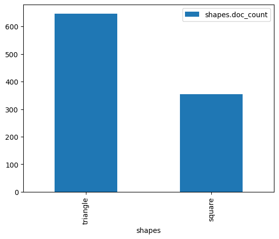
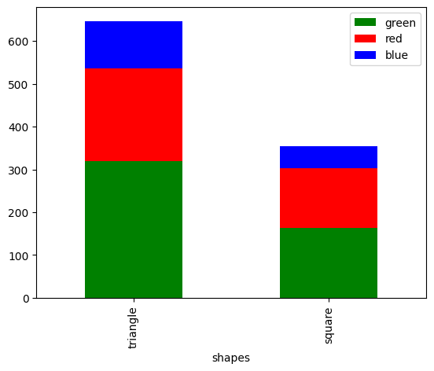
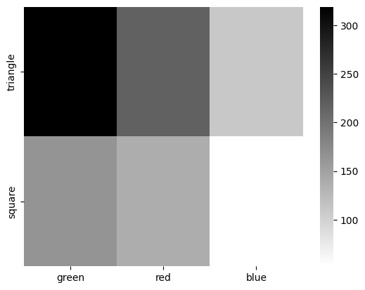

Don’t be plastic, elastipy!
===========================

Hi there, this tutorial is actually a `jupyter
notebook <https://jupyter.org/>`__ and can be found in
`examples <https://github.com/netzkolchose/elastipy/blob/development/examples/>`__/`tutorial.ipynb <https://github.com/netzkolchose/elastipy/blob/development/examples/tutorial.ipynb>`__

Exporting some objects
----------------------

First put some data into an elasticsearch index. The ``Exporter`` is a
convenience api included in elastipy:

.. code:: python3

    from elastipy import Exporter
    
    class ShapeExporter(Exporter):
        INDEX_NAME = "elastipy-example-shapes"
        MAPPINGS = {
            "properties": {
                "shape": {"type": "keyword"},
                "color": {"type": "keyword"},
                "area": {"type": "float"},
            }
        }

The ``INDEX_NAME`` is obviously the name of the elasticsearch index. The
``MAPPINGS`` parameter describes the `explicit
mapping <https://www.elastic.co/docs/manage-data/data-store/mapping/explicit-mapping>`__.
The above says that documents will **at least** have these common
fields, one of type ``float`` and two of type ``keyword`` which means
they are strings but not full-text searchable ones. Instead they are
efficiently indexed and aggregatable.

The data for this tutorial is created out of thin air..

.. code:: python3

    import random
    
    def shape_generator(count=1000, seed=42):
        rnd = random.Random(seed)
        for i in range(count):
            yield {
                "shape": rnd.choices(("triangle", "square"), weights=[2, 1])[0],
                "color": rnd.choices(("red", "green", "blue"), weights=[2, 3, 1])[0],
                "area": rnd.gauss(5, 1),
            }

Create an exporter instance and export a couple of documents.
Internally, it uses the `bulk helper
tools <https://elasticsearch-py.readthedocs.io/en/7.10.0/helpers.html#bulk-helpers>`__
which makes it pretty fast.

.. code:: python3

    exporter = ShapeExporter()
    
    count, errors = exporter.export_list(shape_generator(), refresh=True)
    
    print(count, "exported")

.. parsed-literal::

    1000 exported

The ``refresh=True`` parameter will refresh the index as soon as
everything is exported, so we do not have to wait for objects to appear
in the elasticsearch index.

Query oh elastipyia
-------------------

In most cases this import statement is enough to access all the good
stuff:

.. code:: python3

    from elastipy import Search, query

All access starts with a ``Search`` object:

.. code:: python3

    s = Search(index="elastipy-example-shapes")

**s** is a search query that can be configured further. The
search/filter settings can be considered immutable and any change will
return a new instance. This is setting the maximum number of documents
to respond:

.. code:: python3

    s = s.size(3)

Next add a
`query <https://www.elastic.co/guide/en/elasticsearch/reference/current/query-dsl.html>`__,
more specifically a `term
query <https://www.elastic.co/guide/en/elasticsearch/reference/current/query-dsl-term-query.html>`__.

.. code:: python3

    s = s.term(field="color", value="green")

At this point, the request to elasticsearch would look like this when
executed:

.. code:: python3

    s.dump()

.. parsed-literal::

    {
      "index": "elastipy-example-shapes",
      "query": {
        "term": {
          "color": {
            "value": "green"
          }
        }
      },
      "size": 3
    }

More queries can be added, which creates an **AND** combination:

.. code:: python3

    s = s.range(field="area", gt=5.)
    s.dump()

.. parsed-literal::

    {
      "index": "elastipy-example-shapes",
      "query": {
        "bool": {
          "must": [
            {
              "term": {
                "color": {
                  "value": "green"
                }
              }
            },
            {
              "range": {
                "area": {
                  "gt": 5.0
                }
              }
            }
          ]
        }
      },
      "size": 3
    }

**OR** combinations can be archived with the
`bool <https://www.elastic.co/guide/en/elasticsearch/reference/current/query-dsl-bool-query.html>`__
query itself or by applying the ``|`` operator to the query classes in
``elastipy.query``:

.. code:: python3

    s = s | (query.Term(field="color", value="red") & query.Range(field="area", gt=8.))
    s.dump()

.. parsed-literal::

    {
      "index": "elastipy-example-shapes",
      "query": {
        "bool": {
          "should": [
            {
              "bool": {
                "must": [
                  {
                    "term": {
                      "color": {
                        "value": "green"
                      }
                    }
                  },
                  {
                    "range": {
                      "area": {
                        "gt": 5.0
                      }
                    }
                  }
                ]
              }
            },
            {
              "bool": {
                "must": [
                  {
                    "term": {
                      "color": {
                        "value": "red"
                      }
                    }
                  },
                  {
                    "range": {
                      "area": {
                        "gt": 8.0
                      }
                    }
                  }
                ]
              }
            }
          ]
        }
      },
      "size": 3
    }

Best to execute the search now before the body get’s too complicated:

.. code:: python3

    response = s.execute()
    response.dump()

.. parsed-literal::

    {
      "took": 0,
      "timed_out": false,
      "_shards": {
        "total": 1,
        "successful": 1,
        "skipped": 0,
        "failed": 0
      },
      "hits": {
        "total": {
          "value": 240,
          "relation": "eq"
        },
        "max_score": 2.0352297,
        "hits": [
          {
            "_index": "elastipy-example-shapes",
            "_id": "zX7xqJoBLqnXesFXBEL8",
            "_score": 2.0352297,
            "_source": {
              "shape": "triangle",
              "color": "red",
              "area": 8.214390971909234
            }
          },
          {
            "_index": "elastipy-example-shapes",
            "_id": "A37xqJoBLqnXesFXBEH8",
            "_score": 1.7277035,
            "_source": {
              "shape": "square",
              "color": "green",
              "area": 5.701983725098863
            }
          },
          {
            "_index": "elastipy-example-shapes",
            "_id": "BX7xqJoBLqnXesFXBEH8",
            "_score": 1.7277035,
            "_source": {
              "shape": "triangle",
              "color": "green",
              "area": 5.115884786700855
            }
          }
        ]
      }
    }

The response object is a small wrapper around ``dict`` that has some
convenience properties.

.. code:: python3

    response.documents

.. parsed-literal::

    [{'shape': 'triangle', 'color': 'red', 'area': 8.214390971909234},
     {'shape': 'square', 'color': 'green', 'area': 5.701983725098863},
     {'shape': 'triangle', 'color': 'green', 'area': 5.115884786700855}]

How many documents are there at all?

.. code:: python3

    Search(index="elastipy-example-shapes").execute().total_hits

.. parsed-literal::

    1000

--------------

The functions and properties are chainable in a way that allows for
powerful oneliners:

.. code:: python3

    (Search(index="elastipy-example-shapes")
     .size(20)
     .sort("-area")
     .execute()
     .documents)

.. parsed-literal::

    [{'shape': 'triangle', 'color': 'green', 'area': 8.330268863561772},
     {'shape': 'triangle', 'color': 'red', 'area': 8.214390971909234},
     {'shape': 'triangle', 'color': 'green', 'area': 8.035714298111555},
     {'shape': 'square', 'color': 'red', 'area': 7.953779264139932},
     {'shape': 'triangle', 'color': 'green', 'area': 7.951464274507744},
     {'shape': 'square', 'color': 'green', 'area': 7.729019501856975},
     {'shape': 'square', 'color': 'green', 'area': 7.7277445986992355},
     {'shape': 'triangle', 'color': 'red', 'area': 7.653062656060873},
     {'shape': 'triangle', 'color': 'green', 'area': 7.4486474921016175},
     {'shape': 'triangle', 'color': 'green', 'area': 7.358467740950147},
     {'shape': 'triangle', 'color': 'green', 'area': 7.345359297086998},
     {'shape': 'triangle', 'color': 'green', 'area': 7.331165182486843},
     {'shape': 'square', 'color': 'red', 'area': 7.323704274255894},
     {'shape': 'triangle', 'color': 'blue', 'area': 7.289500917464586},
     {'shape': 'triangle', 'color': 'green', 'area': 7.27932982770514},
     {'shape': 'square', 'color': 'blue', 'area': 7.240943703775567},
     {'shape': 'triangle', 'color': 'green', 'area': 7.235944858014003},
     {'shape': 'triangle', 'color': 'green', 'area': 7.229998540520781},
     {'shape': 'triangle', 'color': 'red', 'area': 7.206929349152892},
     {'shape': 'triangle', 'color': 'red', 'area': 7.1907750313906424}]

It’s not so much about putting everything in one line but rather to
avoid assignments of temporary variables.

Agitated aggregation
--------------------

Aggregations can be created using the ``agg_``, ``metric_`` and
``pipeline_`` prefixes. An aggregation is **attached** to the ``Search``
instance, so there is no copying like with the queries above.

.. code:: python3

    s = Search(index="elastipy-example-shapes").size(0)
    
    agg = s.agg_terms(field="shape")
    
    s.dump()

.. parsed-literal::

    {
      "index": "elastipy-example-shapes",
      "aggregations": {
        "a0": {
          "terms": {
            "field": "shape"
          }
        }
      },
      "query": {
        "match_all": {}
      },
      "size": 0
    }

As we can see, a `terms
aggregation <https://www.elastic.co/guide/en/elasticsearch/reference/current/search-aggregations-bucket-terms-aggregation.html>`__
has been added to the request body. The names of aggregations are
auto-generated, but can be explicitly set:

.. code:: python3

    s = Search(index="elastipy-example-shapes").size(0)
    
    agg = s.agg_terms("shapes", field="shape")
    
    s.dump()

.. parsed-literal::

    {
      "index": "elastipy-example-shapes",
      "aggregations": {
        "shapes": {
          "terms": {
            "field": "shape"
          }
        }
      },
      "query": {
        "match_all": {}
      },
      "size": 0
    }

Let’s look at the result from elasticsearch:

.. code:: python3

    s.execute().dump()

.. parsed-literal::

    {
      "took": 0,
      "timed_out": false,
      "_shards": {
        "total": 1,
        "successful": 1,
        "skipped": 0,
        "failed": 0
      },
      "hits": {
        "total": {
          "value": 1000,
          "relation": "eq"
        },
        "max_score": null,
        "hits": []
      },
      "aggregations": {
        "shapes": {
          "doc_count_error_upper_bound": 0,
          "sum_other_doc_count": 0,
          "buckets": [
            {
              "key": "triangle",
              "doc_count": 646
            },
            {
              "key": "square",
              "doc_count": 354
            }
          ]
        }
      }
    }

Valuable access
~~~~~~~~~~~~~~~

Because we kept the ``agg`` variable, we can use it’s interface to
access the response values more conveniently:

.. code:: python3

    agg.to_dict()

.. parsed-literal::

    {'triangle': 646, 'square': 354}

It supports the ``items()``, ``keys()`` and ``values()`` generators as
known from the ``dict`` type:

.. code:: python3

    for key, value in agg.items():
        print(f"{key:12} {value}")

.. parsed-literal::

    triangle     646
    square       354

It also has a ``dict_rows()`` generator which preserves the **names**
and **keys** of the aggregations:

.. code:: python3

    for row in agg.dict_rows():
        print(row)

.. parsed-literal::

    {'shapes': 'triangle', 'shapes.doc_count': 646}
    {'shapes': 'square', 'shapes.doc_count': 354}

The ``rows()`` generator flattens the ``dict_rows()`` into a CSV-style
list:

.. code:: python3

    for row in agg.rows():
        print(row)

.. parsed-literal::

    ['shapes', 'shapes.doc_count']
    ['triangle', 646]
    ['square', 354]

There exist some helper methods for the terminal:

.. code:: python3

    agg.dump.table(colors=False)

.. parsed-literal::

    shapes   │ shapes.doc_count                           
    ─────────┼────────────────────────────────────────────
    triangle │ 646 ███████████████████████████████████████
    square   │ 354 █████████████████████▊                 

(The ``colors=False`` parameter disables console colors because they do
not work in this documentation)

.. code:: python3

    agg.dump.hbar(colors=False)

.. parsed-literal::

                     0.0     55.57   111.14  166.71  222.28  277.849 333.419 388.989 444.559 500.129 555.699      
                   ┌─┼───────┼───────┼───────┼───────┼───────┼───────┼───────┼───────┼───────┼───────┼────────────
    triangle | 646 ┼ █████████████████████████████████████████████████████████████████████████████████████████████
    square   | 354 ┼ ██████████████████████████████████████████████████▉                                          
                   └─┼───────┼───────┼───────┼───────┼───────┼───────┼───────┼───────┼───────┼───────┼────────────
                     0.0     55.57   111.14  166.71  222.28  277.849 333.419 388.989 444.559 500.129 555.699      

--------------

Working with tables in python is best done with a `pandas
DataFrame <https://pandas.pydata.org/pandas-docs/stable/reference/api/pandas.DataFrame.html>`__:

.. code:: python3

    agg.to_pandas()  # or simply agg.df()

.. raw:: html

    

    
    <table border="1" class="dataframe">
      <thead>
        <tr style="text-align: right;">
          <th></th>
          <th>shapes</th>
          <th>shapes.doc_count</th>
        </tr>
      </thead>
      <tbody>
        <tr>
          <th>0</th>
          <td>triangle</td>
          <td>646</td>
        </tr>
        <tr>
          <th>1</th>
          <td>square</td>
          <td>354</td>
        </tr>
      </tbody>
    </table>
    

Columns containing ISO-formatted date strings will be converted to
``pandas.Timestamp`` (unless ``convert_datetime=False`` is specified).

The DataFrame
`index <https://pandas.pydata.org/pandas-docs/stable/reference/api/pandas.Index.html#pandas.Index>`__
is not set. You can set it the usual way, once the DataFrame is created,
as well as renaming columns, and so on:

.. code:: python3

    agg.to_pandas().set_index("shapes") \
       .rename({"shapes.doc_count": "count"}, axis=1)

.. raw:: html

    

    
    <table border="1" class="dataframe">
      <thead>
        <tr style="text-align: right;">
          <th></th>
          <th>count</th>
        </tr>
        <tr>
          <th>shapes</th>
          <th></th>
        </tr>
      </thead>
      <tbody>
        <tr>
          <th>triangle</th>
          <td>646</td>
        </tr>
        <tr>
          <th>square</th>
          <td>354</td>
        </tr>
      </tbody>
    </table>
    

With ``matplotlib`` installed you can access the `pandas plotting
interface <https://pandas.pydata.org/pandas-docs/stable/reference/api/pandas.DataFrame.plot.html>`__:

.. code:: python3

    agg.df().set_index("shapes").plot.bar()

Satisfied with a little graphic you feel more confident and look into
the details of **metrics** and nested **bucket** aggregations.

Deeper aggregation agitation
~~~~~~~~~~~~~~~~~~~~~~~~~~~~

Multiple levels of nested aggregations become handleable with elastipy.

.. code:: python3

    agg = (
        Search(index="elastipy-example-shapes") 
        .agg_terms("shapes", field="shape") 
        .agg_terms("colors", field="color") 
        .metric_sum("area", field="area") 
        .metric_avg("area-avg", field="area") 
        .execute()
    )

A few notes:

-  ``agg_`` methods always return the newly created aggregation, so the
   ``colors`` aggregation is nested inside the ``shapes`` aggregation.
-  ``metric_`` methods return their parent aggregation (because metrics
   do not allow a nested aggregation), so we can just continue to call
   ``metric_*`` and each time we add a metric to the ``colors``
   aggregation. If you need to get access to the metric object itself
   add the ``return_self=True`` parameter.
-  The ``execute`` method on an aggregation does not return the response
   but the aggregation itself.

Now, what does the ``to_dict`` output look like?

.. code:: python3

    agg.to_dict()

.. parsed-literal::

    {('triangle', 'green'): 319,
     ('triangle', 'red'): 217,
     ('triangle', 'blue'): 110,
     ('square', 'green'): 164,
     ('square', 'red'): 138,
     ('square', 'blue'): 52}

It has put the **keys** that lead to each value into tuples. Without a
lot of thinking we can say:

.. code:: python3

    data = agg.to_dict()
    print(f"There are {data[('triangle', 'red')]} red triangles in the database!")

.. parsed-literal::

    There are 217 red triangles in the database!

But where are the metrics gone?

Generally, ``keys()``, ``values()``, ``items()``, ``to_dict()`` and
``to_matrix()`` only access the values of the **current aggregation**
(which is ``colors`` in the example). Although all the keys of the
parent **bucket** aggregations that lead to the values are included.

The methods ``dict_rows()``, ``rows()``, ``to_pandas()`` and
``.dump.table()`` will access **all values** from the whole aggregation
branch. In this example the branch looks like this:

-  shapes

   -  colors

      -  area
      -  area-avg

.. code:: python3

    agg.dump.table(digits=3, colors=False)

.. parsed-literal::

    shapes   │ shapes.doc_count    │ colors │ colors.doc_count    │ area                    │ area-avg            
    ─────────┼─────────────────────┼────────┼─────────────────────┼─────────────────────────┼─────────────────────
    triangle │ 646 ███████████████ │ green  │ 319 ███████████████ │ 1616.144 ██████████████ │ 5.066 ██████████████
    triangle │ 646 ███████████████ │ red    │ 217 ██████████▌     │ 1084.841 █████████▋     │ 4.999 █████████████▊
    triangle │ 646 ███████████████ │ blue   │ 110 █████▊          │  545.823 █████▍         │ 4.962 █████████████▊
    square   │ 354 ████████▋       │ green  │ 164 ████████▎       │   816.56 ███████▌       │ 4.979 █████████████▊
    square   │ 354 ████████▋       │ red    │ 138 ███████         │  662.202 ██████▎        │ 4.799 █████████████▍
    square   │ 354 ████████▋       │ blue   │  52 ███▎            │  258.043 ██▉            │ 4.962 █████████████▊

Now all information is in the table. Note that the ``shapes.doc_count``
column contains the same value multiple times. This is because each
``colors`` aggregation bucket splits the ``shapes`` bucket into multiple
results, without changing the overall count of the shapes, of course.

It’s possible to move the keys of sub-aggregations into new columns with
the ``flat`` parameter. Below we basically say: Drop the ``colors`` and
``colors.doc_count`` columns and instead create a column for each
encountered color key. The names of following sub-aggregations and
metrics are appended to each key. (Also the resulting ``area-avg``
columns are excluded to not hurt our eyes too much)

.. code:: python3

    agg.dump.table(flat="colors", exclude="*avg", digits=3, colors=False)

.. parsed-literal::

    shapes   │ shapes.doc_count │ green      │ green.area      │ red     │ red.area     │ blue     │ blue.area    
    ─────────┼──────────────────┼────────────┼─────────────────┼─────────┼──────────────┼──────────┼──────────────
    triangle │ 646 ████████████ │ 319 ██████ │ 1616.144 ██████ │ 217 ███ │ 1084.841 ███ │ 110 ████ │ 545.823 █████
    square   │ 354 ██████▉      │ 164 ███▍   │   816.56 ███▎   │ 138 █▉  │  662.202 █▉  │  52 ██   │ 258.043 ██▌  

This can be useful for stacking bars in a plot:

.. code:: python3

    df = agg.df(flat="colors", exclude=("*doc_count", "*area*")).set_index("shapes")
    df.plot.bar(stacked=True, color=df.columns)

--------------

Now what is this method with the awesome name ``to_matrix``?

.. code:: python3

    names, keys, matrix = agg.to_matrix()
    print("names ", names)
    print("keys  ", keys)
    print("matrix", matrix)

.. parsed-literal::

    names  ['shapes', 'colors']
    keys   [['triangle', 'square'], ['green', 'red', 'blue']]
    matrix [[319, 217, 110], [164, 138, 52]]

It produces a heatmap! At least in two dimensions. In this example we
have two dimensions from the **bucket** aggregations ``shapes`` and
``colors``. ``to_matrix()`` will produce a matrix with any number of
dimensions, but if it’s one or two, we can also convert it to a
``DataFrame``:

.. code:: python3

    agg.df_matrix()

.. raw:: html

    

    
    <table border="1" class="dataframe">
      <thead>
        <tr style="text-align: right;">
          <th></th>
          <th>green</th>
          <th>red</th>
          <th>blue</th>
        </tr>
      </thead>
      <tbody>
        <tr>
          <th>triangle</th>
          <td>319</td>
          <td>217</td>
          <td>110</td>
        </tr>
        <tr>
          <th>square</th>
          <td>164</td>
          <td>138</td>
          <td>52</td>
        </tr>
      </tbody>
    </table>
    

To access the values of metrics we have to call ``to_matrix`` on a
metric aggregation. Our ``agg`` parameter contains the ``area`` and
``area-avg`` metrics and we can reach it with the ``children`` property.
Below is the heatmap of the average area. Except for the values, nothing
changed because metrics (and pipelines) do not contribute to the
``key``\ s.

.. code:: python3

    agg.children[1].df_matrix()

.. raw:: html

    

    
    <table border="1" class="dataframe">
      <thead>
        <tr style="text-align: right;">
          <th></th>
          <th>green</th>
          <th>red</th>
          <th>blue</th>
        </tr>
      </thead>
      <tbody>
        <tr>
          <th>triangle</th>
          <td>5.066282</td>
          <td>4.999269</td>
          <td>4.962023</td>
        </tr>
        <tr>
          <th>square</th>
          <td>4.979024</td>
          <td>4.798568</td>
          <td>4.962364</td>
        </tr>
      </tbody>
    </table>
    

Having something like `seaborn <https://seaborn.pydata.org/>`__
installed we can easily plot it:

.. code:: python3

    import seaborn as sns
    
    sns.heatmap(agg.df_matrix(), cmap="gray_r")

Once you learn the basics and how specific aggregations and metrics are
called, elastipy is a clean and powerful tool for data-mining,
especially in a `jupyter notebook <https://jupyter.org/>`__. Even more
if you are familiar with
`pandas <https://pandas.pydata.org/pandas-docs/stable/index.html>`__.

.. code:: python3

    (
        Search(index="elastipy-example-shapes") 
        .agg_terms("shapes", field="shape")
        .agg_terms("colors", field="color") 
        .metric_stats("area", field="area") 
        .execute()
        .df(exclude="*.doc_count")
        .set_index(["shapes", "colors"]).unstack("shapes")
    )

.. raw:: html

    

    
    <table border="1" class="dataframe">
      <thead>
        <tr>
          <th></th>
          <th colspan="2" halign="left">area.count</th>
          <th colspan="2" halign="left">area.min</th>
          <th colspan="2" halign="left">area.max</th>
          <th colspan="2" halign="left">area.sum</th>
          <th colspan="2" halign="left">area.avg</th>
        </tr>
        <tr>
          <th>shapes</th>
          <th>square</th>
          <th>triangle</th>
          <th>square</th>
          <th>triangle</th>
          <th>square</th>
          <th>triangle</th>
          <th>square</th>
          <th>triangle</th>
          <th>square</th>
          <th>triangle</th>
        </tr>
        <tr>
          <th>colors</th>
          <th></th>
          <th></th>
          <th></th>
          <th></th>
          <th></th>
          <th></th>
          <th></th>
          <th></th>
          <th></th>
          <th></th>
        </tr>
      </thead>
      <tbody>
        <tr>
          <th>blue</th>
          <td>52</td>
          <td>110</td>
          <td>2.944463</td>
          <td>2.007018</td>
          <td>7.240944</td>
          <td>7.289501</td>
          <td>258.042935</td>
          <td>545.822560</td>
          <td>4.962364</td>
          <td>4.962023</td>
        </tr>
        <tr>
          <th>green</th>
          <td>164</td>
          <td>319</td>
          <td>2.240493</td>
          <td>2.414815</td>
          <td>7.729020</td>
          <td>8.330269</td>
          <td>816.559945</td>
          <td>1616.144104</td>
          <td>4.979024</td>
          <td>5.066282</td>
        </tr>
        <tr>
          <th>red</th>
          <td>138</td>
          <td>217</td>
          <td>1.062725</td>
          <td>2.282349</td>
          <td>7.953779</td>
          <td>8.214391</td>
          <td>662.202342</td>
          <td>1084.841326</td>
          <td>4.798568</td>
          <td>4.999269</td>
        </tr>
      </tbody>
    </table>
    

